<!--
  To incorporate into the main EDA document:
  Copy everything below this YAML header and paste it after the
  clustering code sections in "EDA Master Control.Rmd".
  Remove the  tags since the main Rmd generates plots inline.
-->

## Clustering Analysis: Interpretation & Findings

The four clustering analyses below segment MasterControl's lead pipeline from different angles — account profiles, job title roles, Mx-specific lead profiles, and successful-lead ICPs — to identify which combinations of features drive Mx conversion.

---

### Analysis 1: Account Profile Clustering (Gower + PAM, k=2)

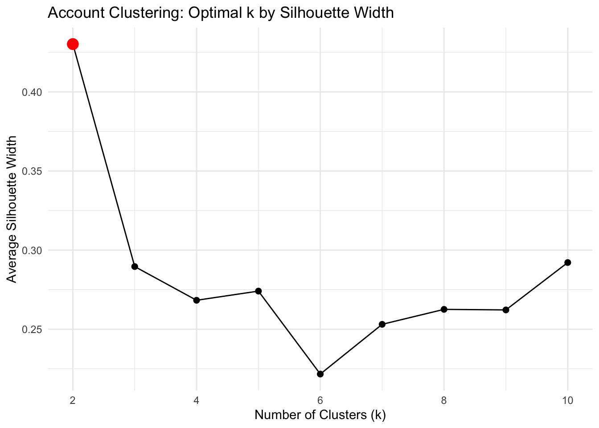

**Silhouette:** k=2 is optimal with avg silhouette ~0.43 — a reasonably strong structure. The silhouette plot shows both clusters are well-formed with minimal negative-width observations.

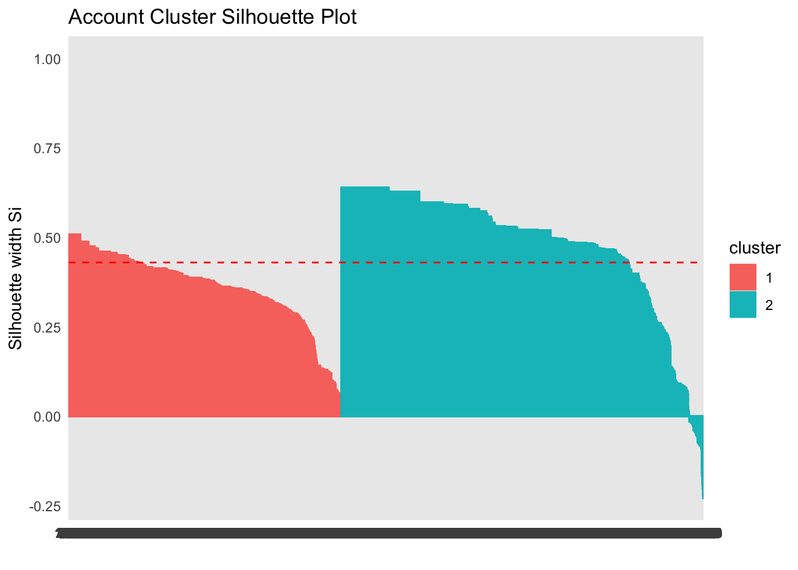

**Two account archetypes identified:**

- **Cluster 1 ("Core Pharma"):** Americas-dominant (57%), Pharma & BioTech (57%), In-House manufacturing (62%), Active Pharma Mfg (31%), Medium tier (60%).
- **Cluster 2 ("Diverse / Low-Info"):** More geographically diverse (EMEA 27%, APAC 13%), Medium tier (54%) but more Small accounts (20% vs Cluster 1), higher Non-Mfg/Low Info (61%), more Low Info manufacturing model (60%).

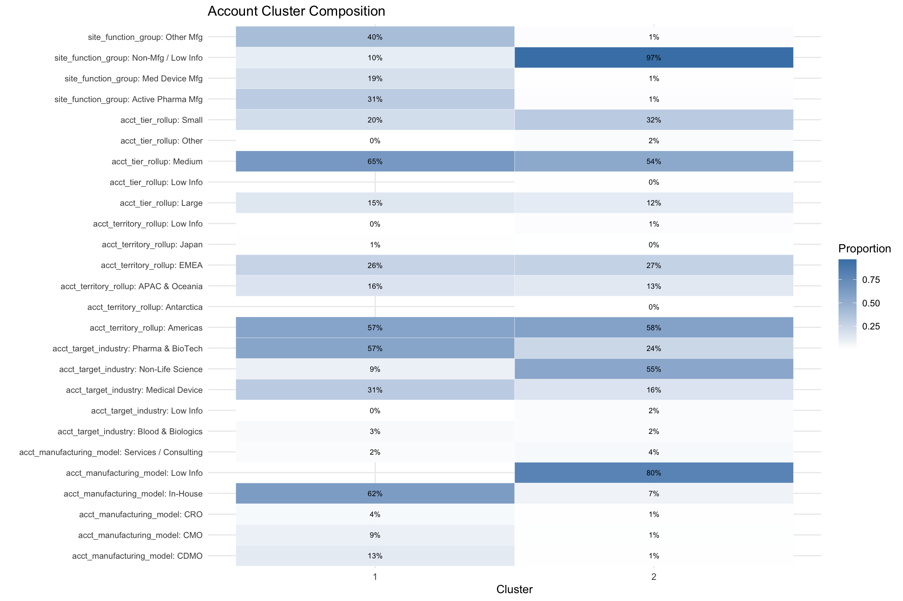

**Key conversion finding:** Cluster 1 (Core Pharma) has Mx conversion of **17.7%** vs Cluster 2 at **7.2%**. Cluster 1 also has Qx at 31.5% vs Cluster 2 at 13.1%. The Core Pharma archetype converts at 2.5x the rate for Mx. This is a major targeting signal.

**MCA biplot:** The two clusters separate cleanly along Dim 1 (8.6% variance), with Cluster 2 spreading into higher Dim 2 values — likely driven by the rare/diverse categories.

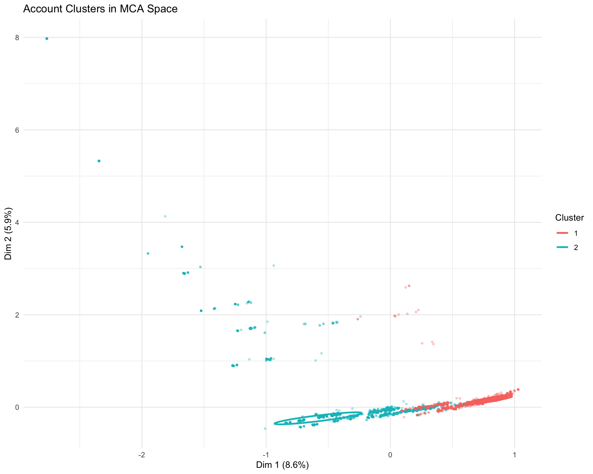

---

### Analysis 2: Title Role Clustering (Jaccard + Hierarchical, k=12)

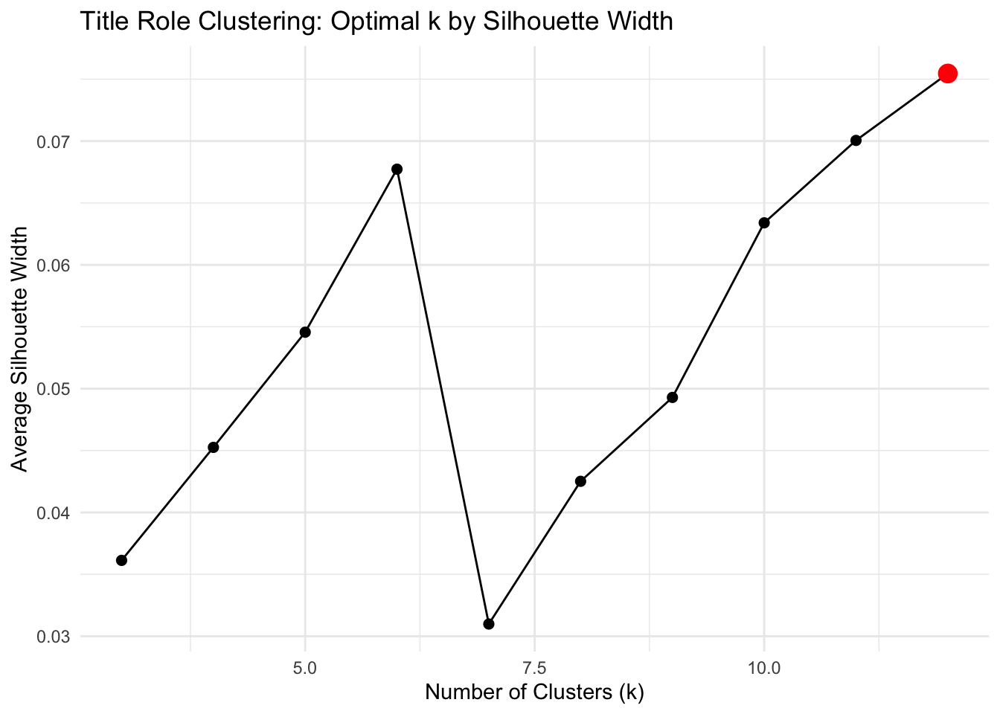

**Silhouette:** Very low scores (0.03–0.075 range), peaking at k=12. This indicates weak cluster structure in title words — titles are highly heterogeneous and don't form tight groups. The dendrogram shows gradual merging rather than sharp cuts.

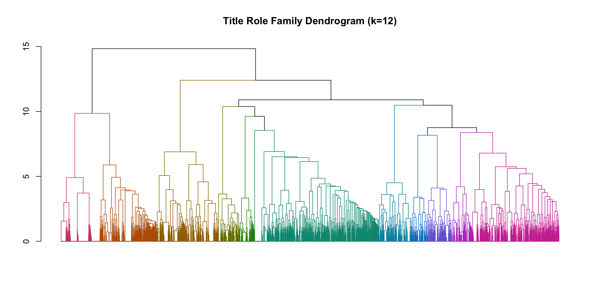

**Heatmap insights (most interpretable clusters):**

| Cluster | Dominant Title Keywords | Interpretation |
|---------|------------------------|----------------|
| 3 | quality, assurance, manager | Quality/QA Managers |
| 7 | director, operations | Operations Directors |
| 10 | manufacturing, engineering | Manufacturing Engineers |
| 11 | regulatory, affairs | Regulatory Affairs |
| 1 | manager (general) | General Managers |
| 8/9 | information, technology | IT Roles (very small n) |

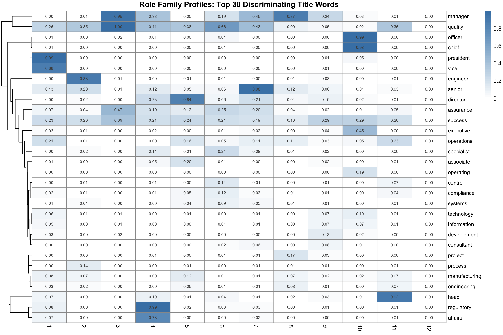

**Key conversion finding:** Cluster 3 (quality-focused) has the highest Mx conversion at **15.2%** with n=734 — above the 12.7% Mx average. Cluster 5 also shows Mx at 11.7% (n=539). Clusters 8 and 9 (IT-focused) have near-zero Mx conversion. The quality/assurance role family is the strongest Mx conversion signal from titles.

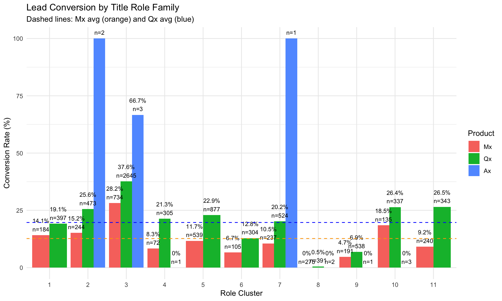

**t-SNE:** Shows some spatial separation of clusters but significant overlap, consistent with the low silhouette scores. The clusters are more of a soft partitioning than hard boundaries.

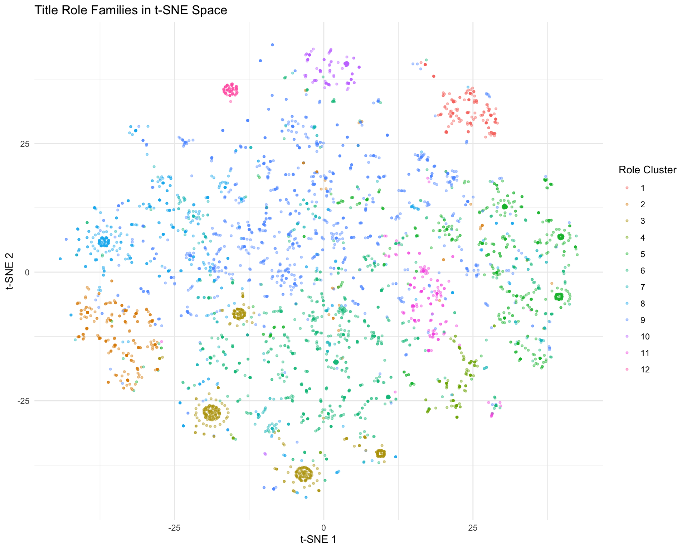

---

### Analysis 3: Mx-Specific Lead Profile Clustering (MCA + k-means, k=6)

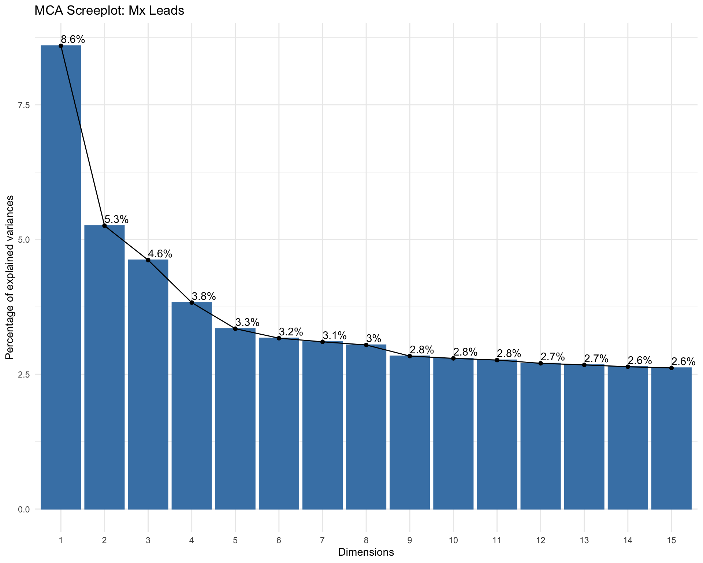

**MCA screeplot:** Very flat — Dim 1 explains only 8.6%, and it takes all 15 dimensions to reach ~50% cumulative inertia. This reflects the high dimensionality and categorical nature of the data.

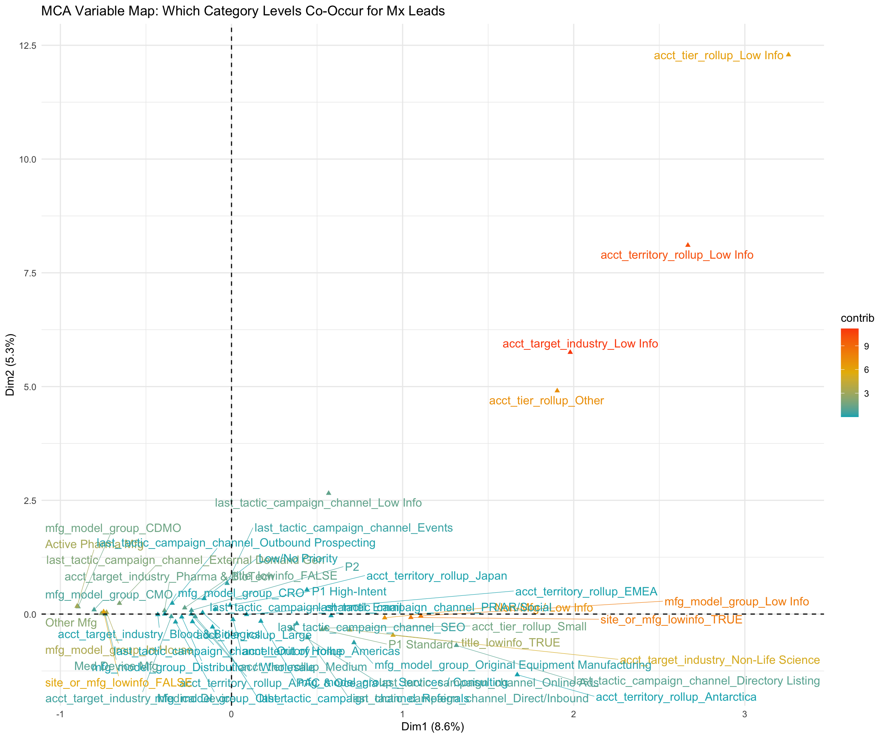

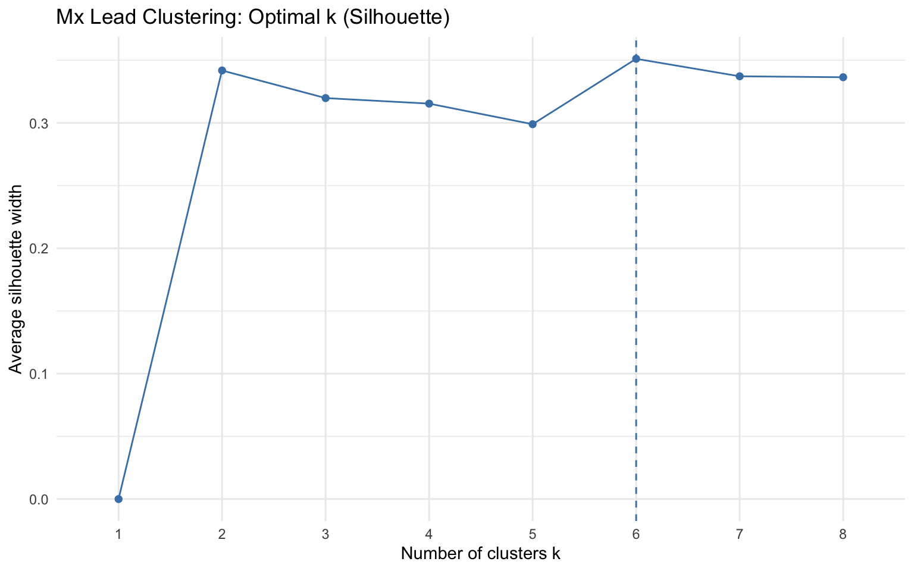

**Conversion by Mx cluster — the most actionable finding:**

| Cluster | Conversion Rate | n (% of Mx) | Label |
|---------|----------------|-------------|-------|
| 5 | **20.5%** | 680 (16.5%) | "Golden Profile" |
| 6 | **18.82%** | 186 (4.5%) | Small, high-converting |
| 2 | **15.26%** | 1,455 (35.3%) | Largest above-average |
| 3 | 12.37% | 930 (22.5%) | At average |
| 1 | 11.32% | 53 (1.3%) | Small, slightly below |
| 4 | **1.95%** | 821 (19.9%) | "Avoid Profile" |

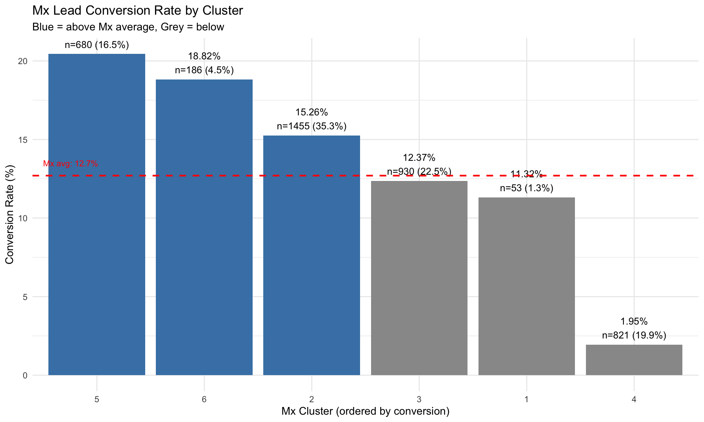

**Business implication:** Cluster 4 represents ~20% of all Mx leads but converts at only 2%. These 821 leads are likely targeting waste. Meanwhile, Clusters 5+6+2 (56.3% of leads) convert at 15–21%, well above the 12.7% average. Profiling what distinguishes Cluster 4 from Cluster 5 would directly inform targeting improvements.

---

### Analysis 4: ICP Discovery (Gower + PAM on successful Mx leads, k=2)

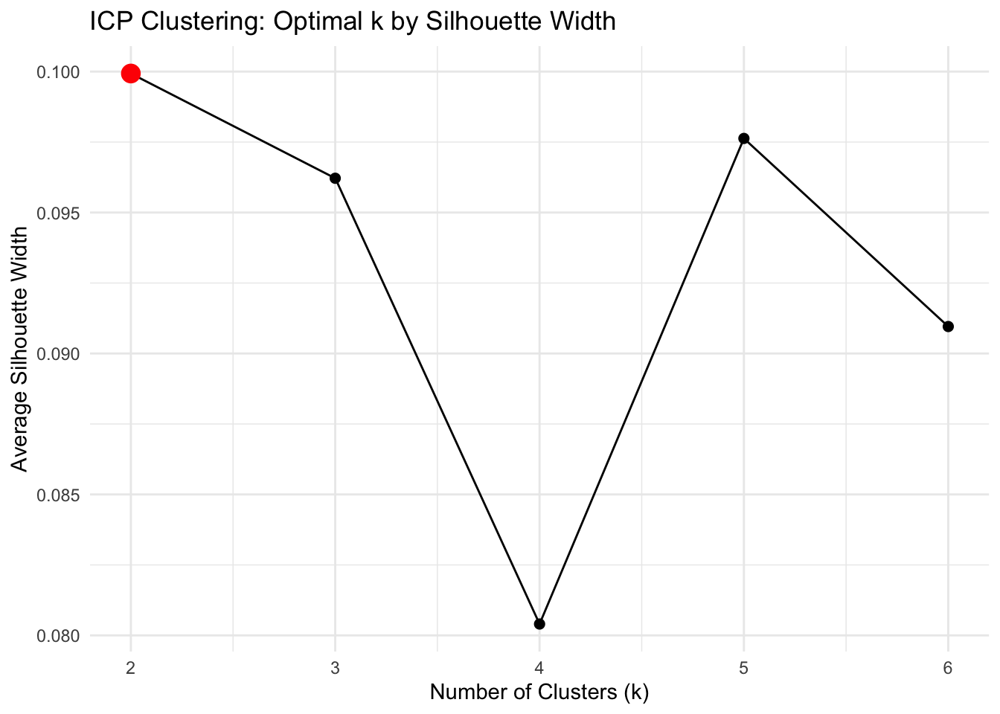

**Silhouette:** Very low (~0.10 at k=2). The successful leads don't form distinct internal clusters — they're relatively homogeneous, which actually makes sense: successful leads share a common profile.

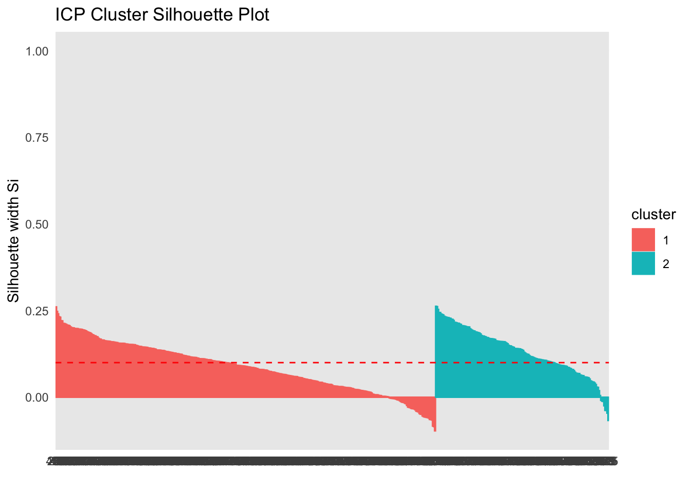

**ICP vs Population comparison — over/under-representation in successful Mx leads:**

| Feature | All Mx Leads | Successful Mx Leads | Signal |
|---------|-------------|-------------------|--------|
| Americas territory | ~53% | ~62% | Over-represented |
| APAC & Oceania | ~21% | ~14% | Under-represented |
| Medical Device industry | ~22% | ~27% | Over-represented |
| Small tier | ~22% | ~29% | Over-represented |
| Large tier | ~15% | ~9% | Under-represented |
| Other Mfg (site function) | ~21% | ~35% | **Strongly over-represented** |
| Non-Mfg / Low Info | ~47% | ~27% | **Strongly under-represented** |

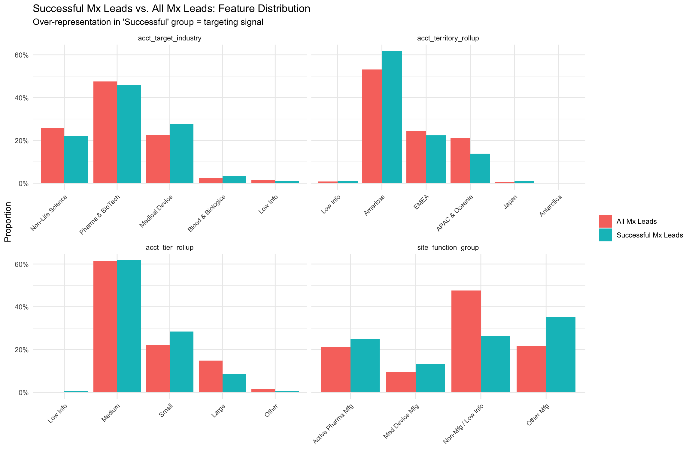

**ICP summary:** The ideal Mx customer is an Americas-based, small-to-medium, Pharma/BioTech or Medical Device company with an actual manufacturing function (not Non-Mfg/Low Info). The Non-Mfg/Low Info segment is the single biggest drag on Mx conversion — it's 47% of all Mx leads but significantly under-represented among successes.

---

## Overall Recommendations

1. **Deprioritize Non-Mfg/Low Info leads for Mx** — they're nearly half the pipeline but dramatically under-convert
2. **Focus Mx targeting on the Core Pharma account archetype** (Americas, Pharma/BioTech, In-House, Active Pharma Mfg) which converts at 17.7% vs 7.2%
3. **Quality/assurance title roles** are the strongest title-based predictor of Mx conversion
4. **Investigate Mx Cluster 4** (the 20% of leads converting at 2%) to understand what makes them fail — likely Non-Mfg/Low Info accounts in non-core territories
5. **The ICP is clear:** Americas + manufacturing-focused + small/medium tier + Pharma or Med Device
